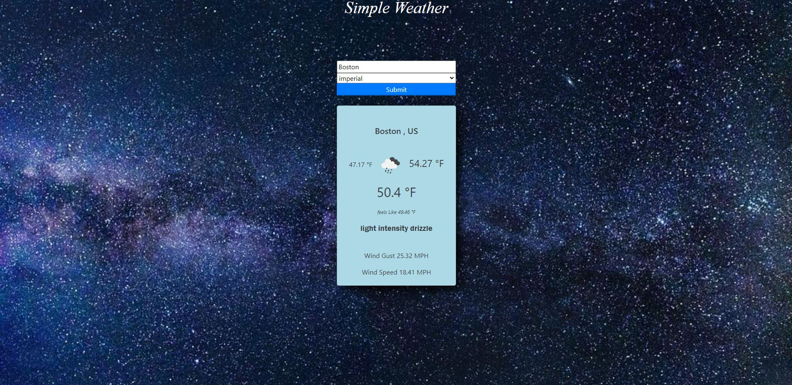

# weather-app
A simple web page that allows users to get current weather in a city of their
choosing by calling the open weather map API and displaying the data in a easily readable format to the user

a deployment of the project is avalavile here: https://jacobm2000.github.io/weather-app/

### Screenshot

